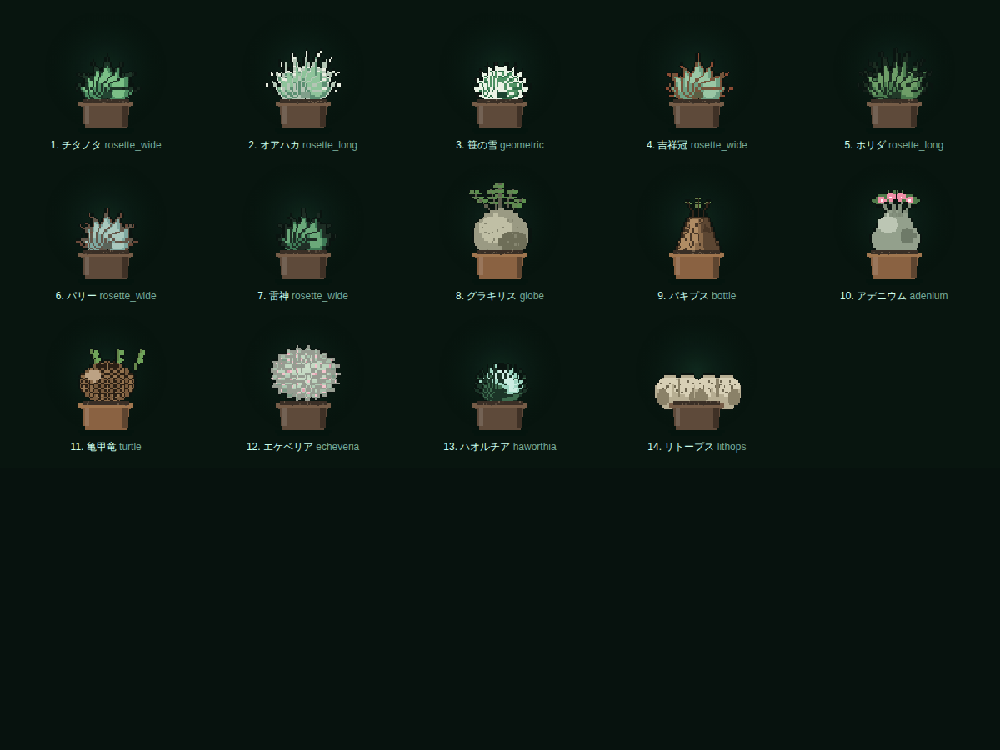

# PIXAGAVE

**育てた実物が、そのままキャラクターになる。**

アガベ・塊根・多肉の写真をドット絵に変換し、**実際の育成が進んだ分だけ**キャラクターが進化する
育成管理アプリ。ビルド不要・依存パッケージなしの静的 Web アプリで、写真も記録もすべて端末内で完結します。


## 起動

```bash
cd agave-pixel
python3 -m http.server 4173     # 任意の静的サーバでよい
# → http://localhost:4173/
```

ES Modules を使うため `file://` では動きません。静的ホスティング(GitHub Pages / Netlify 等)にそのまま置けます。

## できること

| | |
|---|---|
| **写真 → ドット絵** | 背景を自動で落とし、減色・ディザ・輪郭・擬似ライティングを掛けてスプライト化。解像度と色数はその場で調整可能 |
| **写真から個性値** | 輪郭のギザギザさ、充填率、輝度分布から 葉幅 / 締まり / 棘 / 斑 / 白粉 / 成長力 を算出 |
| **品種ごとに描き分けたドット絵** | ロゼット / 幾何 / 球体塊根 / 徳利型 / 亀甲 / 薔薇状 / 窓 / 擬態 の 10 骨格を持つ自前のピクセルラスタライザで生成。段階が上がると葉数と大きさが増える |
| **図鑑番号・タイプ・分類・図鑑説明** | 全 14 品種に No. と 9 種のタイプ、分類名、説明文 |
| **性格** | 迎えた時点で決まり、伸びやすい個性値と伸びにくい個性値が変わる |
| **進化系統図** | 実生 → 完成株までの 5 段階を一覧表示。未到達の段階はシルエット |
| **5 段階の進化** | 経験値・ゲーム内の育成日数・記録写真の 3 つが揃うと進化。残り日数と実時間の目安が常に出る |
| **4 系統の分岐進化** | 成株で 締型 / 錦 / 鬼爪 / 巨大 に分岐。事前に「傾き」が %で見え、育て方で誘導できる |
| **次にやること** | 画面上部に常に 1 つだけ、いま取るべき行動とその理由を表示 |
| **育成シミュレーション** | 水分・養分・健康・害虫が時間で推移。オフライン中の経過も反映 |
| **育て方が姿に出る** | 日照設定と潅水の癖に応じて個性値がドリフトする(弱光なら徒長して締まりが落ちる、など) |
| **アルバムと比較** | 最初↔最新のスライダー比較、ドット絵の変遷 |
| **ケア記録の比較** | 平均潅水間隔・照度・日照時間を品種別の推定コホートと並べて表示 |
| **品評会** | 審査員ごとに好みのタイプがあり、相性で評価が ×1.35 / ×0.78 に変わる。5 部門審査・5 リーグ |
| **交配ラボ** | 成株 2 株から実生。約 20% で突然変異 |
| **季節** | ゲーム内 8 日ごとに移り変わり、成長速度に効く(進化は止めない) |
| **共有画像の書き出し** | ピクセル PNG / 個体カード / IG ストーリー(9:16) / コレクションカバー / 成長ストリップ |
| **7 言語** | 日本語・English・繁體中文・简体中文・한국어・Español・Français |

### 品種ごとのドット絵



## 画面

| 個体詳細 | 個体カード |
|---|---|
|  |  |

## 動作確認

```bash
ln -s /path/to/node_modules node_modules   # playwright が必要
node tools/smoke-test.mjs --shots
```

合成写真を投入して「起動 → 迎える → ピクセル変換 → 記録 → 実測 → 進化(系統分岐まで) →
品評会 → 交配 → 画像書き出し → リロード復元」を通しで確認し、`tools/shots/` にスクリーンショットを出します。

## 育成にかかる時間

育成日数はすべて **ゲーム内の日数** で数え、リアル時間との換算は設定で選べます。

| ペース | 1 ゲーム日 | 完成株(16 ゲーム日)まで |
|---|---|---|
| はやい | 20 分 | 実時間 5〜6 時間 |
| **ふつう(既定)** | 1 時間 | 実時間 16〜20 時間 |
| じっくり | 4 時間 | 実時間 3 日ほど |
| リアル | 24 時間 | 手元の株と同じ速度 |

進化に必要なゲーム日数は 幼苗 1 日 / 若株 3 日 / 成株 8 日 / 完成株 16 日。
経験値は世話をするほど早く貯まるので、放置するより関わったほうが確実に速くなります。
残り日数と実時間の目安は、ホームと個体画面に常に表示されます。

すぐ確認したい場合は **設定 → 時間を進める(体験用)** でゲーム内の日を進められます。

## データの扱い

- ゲーム状態は `localStorage`、写真とスプライトは `IndexedDB` に保存
- 外部へのネットワーク送信は一切ありません
- 設定画面から JSON でバックアップ／復元できます
- コミュニティ統計はサーバを持たないため、品種ごとに端末内で生成した**推定値**です(UI 上でも明示)

## 位置づけ

「写真をドット絵にする」「実際の育成でキャラクターが進化する」という着想は既存アプリ AGAVEDEX
から取っていますが、本実装は画像・コード・ブランド・画面デザインのいずれも複製していない
**独自実装**です。詳細と設計判断は [docs/DESIGN.md](docs/DESIGN.md) を参照してください。

品種データと栽培の目安は一般的な園芸情報に基づく簡易モデルです。実際の栽培判断は現物を見て行ってください。
