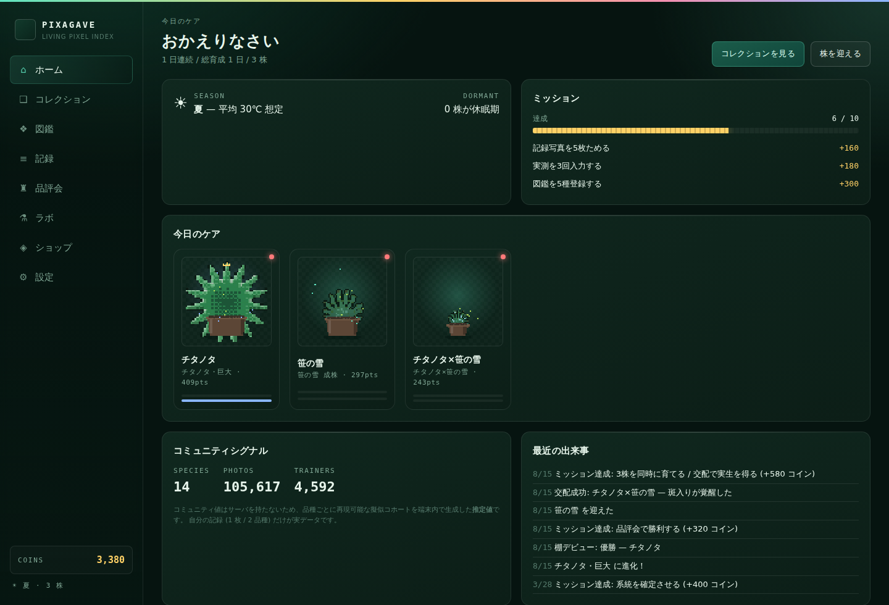
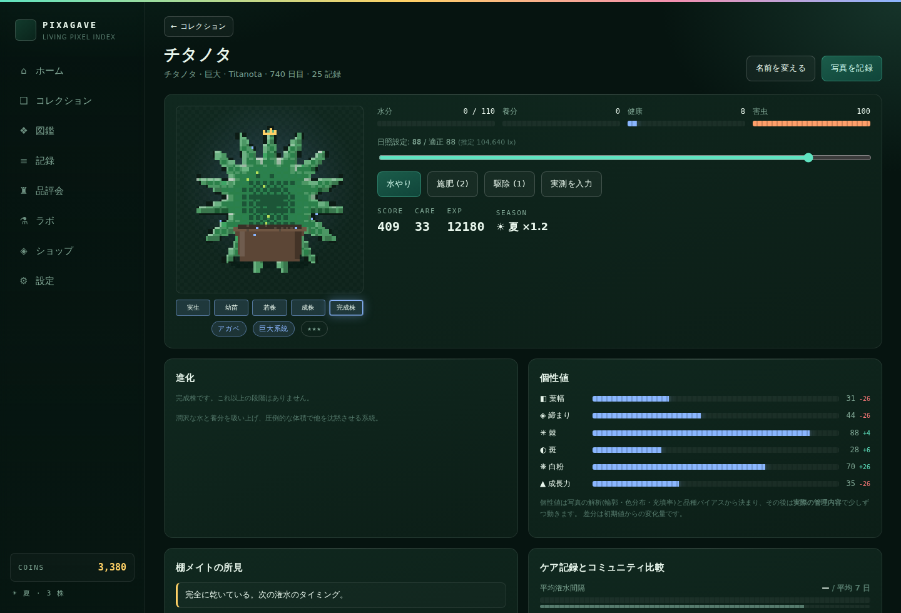
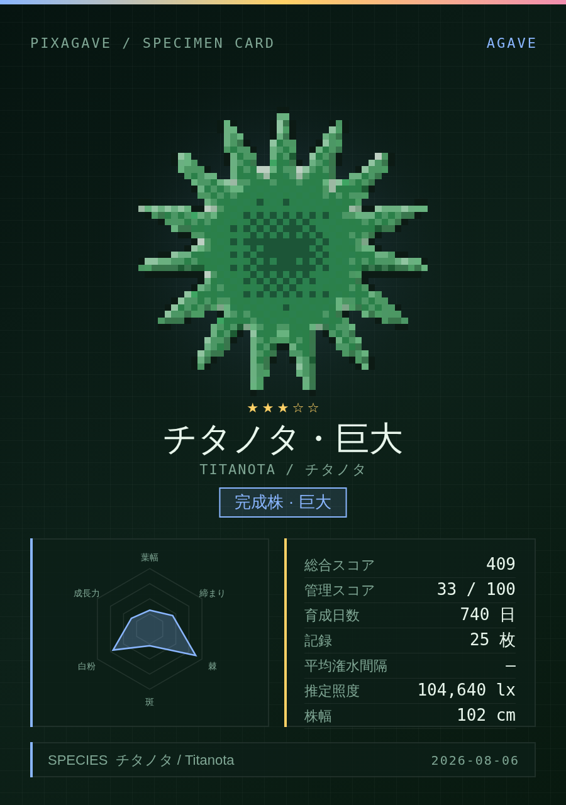

# PIXAGAVE

**育てた実物が、そのままキャラクターになる。**

アガベ・塊根・多肉の写真をドット絵に変換し、**実際の育成が進んだ分だけ**キャラクターが進化する
育成管理アプリ。ビルド不要・依存パッケージなしの静的 Web アプリで、写真も記録もすべて端末内で完結します。



## 起動

```bash
cd agave-pixel
python3 -m http.server 4173     # 任意の静的サーバでよい
# → http://localhost:4173/
```

ES Modules を使うため `file://` では動きません。静的ホスティング(GitHub Pages / Netlify 等)にそのまま置けます。

## できること

| | |
|---|---|
| **写真 → ドット絵** | 背景を自動で落とし、減色・ディザ・輪郭・擬似ライティングを掛けてスプライト化。解像度と色数はその場で調整可能 |
| **写真から個性値** | 輪郭のギザギザさ、充填率、輝度分布から 葉幅 / 締まり / 棘 / 斑 / 白粉 / 成長力 を算出 |
| **育成シミュレーション** | 水分・養分・健康・害虫が実時間で推移。オフライン中の経過も反映 |
| **育て方が姿に出る** | 日照設定と潅水の癖に応じて個性値がドリフトする(弱光なら徒長して締まりが落ちる、など) |
| **5 段階の進化** | 経験値・経過日数・記録写真・実測の伸び・健康・季節をすべて満たすと進化 |
| **4 系統の分岐進化** | 成株で 締型 / 錦 / 鬼爪 / 巨大 に分岐。事前に「傾き」が見え、育て方で誘導できる |
| **図鑑** | 14 品種 × 4 系統 = 56 フォーム |
| **アルバムと比較** | 最初↔最新のスライダー比較、ドット絵の変遷 |
| **ケア記録の比較** | 平均潅水間隔・照度・日照時間を品種別の推定コホートと並べて表示 |
| **品評会** | 姿 / 気迫 / 色 / 貫禄 / 管理 の 5 部門審査。5 リーグ |
| **交配ラボ** | 成株 2 株から実生。約 20% で突然変異 |
| **季節と休眠** | 実際の月に連動。休眠期は水の消費が落ち、進化も止まる |
| **共有画像の書き出し** | ピクセル PNG / 個体カード / IG ストーリー(9:16) / コレクションカバー / 成長ストリップ |
| **7 言語** | 日本語・English・繁體中文・简体中文・한국어・Español・Français |

## 画面

| 個体詳細 | 個体カード |
|---|---|
|  |  |

## 動作確認

```bash
ln -s /path/to/node_modules node_modules   # playwright が必要
node tools/smoke-test.mjs --shots
```

合成写真を投入して「起動 → 迎える → ピクセル変換 → 記録 → 実測 → 進化(系統分岐まで) →
品評会 → 交配 → 画像書き出し → リロード復元」を通しで確認し、`tools/shots/` にスクリーンショットを出します。

## 進化を試したいとき

進化条件は実際の栽培リズムに合わせてあり、完成株までに最短でも 120 日かかります。
動作を確認したいだけの場合は **設定 → 体験用ツール → タイムワープ** で日を進めてください。

## データの扱い

- ゲーム状態は `localStorage`、写真とスプライトは `IndexedDB` に保存
- 外部へのネットワーク送信は一切ありません
- 設定画面から JSON でバックアップ／復元できます
- コミュニティ統計はサーバを持たないため、品種ごとに端末内で生成した**推定値**です(UI 上でも明示)

## 位置づけ

「写真をドット絵にする」「実際の育成でキャラクターが進化する」という着想は既存アプリ AGAVEDEX
から取っていますが、本実装は画像・コード・ブランド・画面デザインのいずれも複製していない
**独自実装**です。詳細と設計判断は [docs/DESIGN.md](docs/DESIGN.md) を参照してください。

品種データと栽培の目安は一般的な園芸情報に基づく簡易モデルです。実際の栽培判断は現物を見て行ってください。
